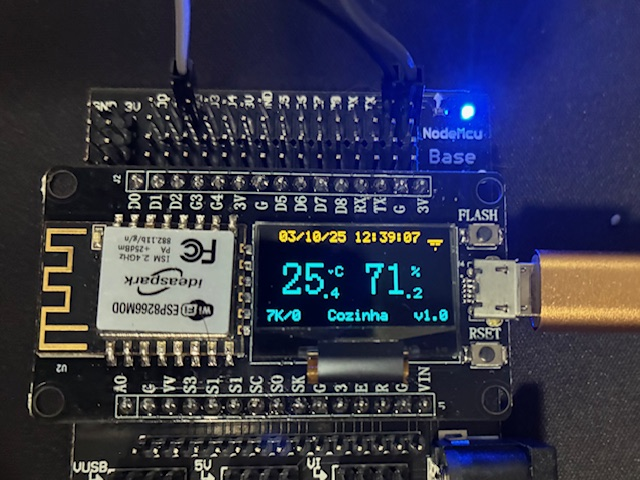

# ESP8266 DHT22 Datalogger with OLED Display SSD1306

Complete temperature and humidity data acquisition and logging system using ESP8266, DHT22 sensor and SSD1306 OLED display, with WiFi connectivity, NTP synchronization, MQTT publishing and HTTP server.



## Features

- **Data Acquisition**: Periodic temperature and humidity readings with DHT22 sensor
- **OLED Display**: Real-time data visualization on SSD1306 128x64 display (I2C) with optional power saving mode
- **WiFi Connectivity**: Automatic connection and smart reconnection
- **Time Synchronization**: NTP synchronized with Brazilian servers
- **MQTT Publishing**: Data transmission to MQTT broker with batching and retry
- **HTTP Server**: Web interface for monitoring and configuration
- **SPIFFS Storage**: Local backup of measurements when offline
- **Modular Architecture**: Refactored code with clear separation of concerns
- **FreeRTOS**: Multitasking system with optimized priorities

## Hardware Components

- **Microcontroller**: ESP8266 (ESP-12E/NodeMCU)
- **Sensor**: DHT22 (temperature and humidity)
- **Display**: OLED SSD1306 128x64 (I2C)
- **I2C Connections**:
  - SDA: GPIO12
  - SCL: GPIO14
  - OLED Address: 0x3C
- **DHT22 Sensor**: GPIO4

## Project Structure

```
esp8266_datalogger_dth22_ssd1306/
├── main/
│   ├── main.c              # Application entry point
│   ├── config.h            # System configuration
│   ├── types.h             # Data type definitions
│   ├── globals.h/c         # Shared global variables
│   ├── wifi_manager.h/c    # WiFi management
│   ├── ntp_manager.h/c     # NTP synchronization
│   ├── mqtt_manager.h/c    # MQTT client
│   ├── http_server.h/c     # HTTP server
│   ├── measurement.h/c     # DHT22 data acquisition
│   ├── oled_display.h/c    # OLED display control
│   ├── spiffs_manager.h/c  # File system management
│   ├── dns_manager.h/c     # DNS cache for MQTT broker
│   ├── system_status.h/c   # System monitoring
│   └── time_cache.h/c      # NTP timestamp cache
├── components/
│   └── ssd1306/            # OLED display driver
├── CMakeLists.txt
├── partitions.csv
└── sdkconfig
```

## Configuration

### Software Requirements

- ESP8266_RTOS_SDK
- CMake 3.5+
- Xtensa Toolchain

### WiFi and MQTT Configuration

⚠️ **IMPORTANT - Security**: This project uses ESP-IDF configuration system which stores credentials in the `sdkconfig` file. This file **MUST NOT be committed** to Git as it contains passwords and sensitive information.

#### Method 1: Using menuconfig (Recommended)

```bash
idf.py menuconfig
```

Navigate to "Datalogger Config" and configure:

- **WiFi SSID**: WiFi network name
- **WiFi Password**: Network password
- **MQTT Broker**: MQTT broker address (e.g., mqtt://broker.hivemq.com:1883)
- **MQTT Username**: MQTT username
- **MQTT Password**: MQTT password
- **MQTT Topic Data**: Topic for data publishing (e.g., sensors/temperature/data)
- **MQTT Topic Status**: Topic for system status (e.g., sensors/temperature/status)
- **Sensor ID**: Unique sensor identifier (e.g., ESP8266-001)
- **Measurement Interval**: Interval between measurements in ms (e.g., 30000 = 30s)
- **Enable OLED Display**: Enable/disable the OLED display (disable to save power)

#### Method 2: Using local configuration file

1. Copy the example file:
```bash
cp sdkconfig.defaults sdkconfig.defaults.local
```

2. Edit `sdkconfig.defaults.local` with your credentials (this file is gitignored)

3. Run build normally:
```bash
idf.py build
```

#### ⚠️ Security Checklist before Git Push

Before pushing to GitHub, **always verify**:

```bash
# Check if sdkconfig is not being tracked
git status | grep sdkconfig

# If it appears, remove from staging
git reset HEAD sdkconfig sdkconfig.old

# Verify .gitignore
cat .gitignore | grep sdkconfig
```

### Build and Flash

```bash
# Configure
idf.py menuconfig

# Build
idf.py build

# Flash
idf.py -p /dev/ttyUSB0 flash

# Monitor
idf.py -p /dev/ttyUSB0 monitor
```

## Main Features

### FreeRTOS Task System

The system operates with multiple tasks with optimized priorities:

| Task | Priority | Function |
|------|----------|----------|
| oled_display | 7 | OLED display updates |
| wifi_monitor | 6 | WiFi connection monitoring |
| ntp_sync | 5 | NTP synchronization |
| mqtt_monitor | 4 | MQTT monitoring |
| measurement | 3 | DHT22 data acquisition |
| http_server | 2 | HTTP server |
| system_status | 1 | System status |

### MQTT Publishing

- **Batching**: Message grouping to optimize transmission
- **Retry**: Automatic resend on failure
- **Backlog**: SPIFFS storage when offline
- **Keep-alive**: Periodic heartbeat to maintain connection

### OLED Display

Displays in real-time:
- Current temperature and humidity
- WiFi connection status
- Local timestamp (GMT configurable)
- User-configurable string
- Number of messages sent/stored
- Special icon that blinks after each measurement

**Power Saving Mode**: The OLED display can be completely disabled via Kconfig to reduce power consumption. When disabled, the display is cleared and turned off during system initialization, saving energy in battery-powered deployments.

### SPIFFS Backup System

- Ring buffer storage (configurable, default: 1000 measurements)
- Automatic synchronization when reconnecting to MQTT
- Data persistence during power outages
- Alert when buffer reaches 80% capacity

## MQTT Data Format

```json
{
  "sensor_id": "ESP8266-001",
  "timestamp": 1696348800,
  "temperature": 25.3,
  "humidity": 62.5
}
```

## Monitoring and Debug

The system provides detailed logs via UART:

```bash
idf.py monitor
```

Available log tags:
- `MAIN` - Main initialization
- `WIFI` - WiFi events
- `NTP` - Time synchronization
- `MQTT` - MQTT publishing and status
- `MEASUREMENT` - Sensor readings
- `OLED` - Display updates
- `SPIFFS` - File system operations
- `HTTP` - HTTP requests

## HTTP API

The HTTP server exposes the following endpoints:

- `GET /` - Main page with system status
- `GET /data` - Latest measurements (JSON)
- `GET /status` - Complete system status (JSON)

## Troubleshooting

### WiFi doesn't connect
- Check SSID and password in menuconfig
- Verify WiFi signal and compatibility (2.4GHz only)

### MQTT doesn't publish
- Check broker connectivity
- Validate MQTT credentials
- Verify configured topics

### Display doesn't work
- Check I2C connections (SDA=GPIO12, SCL=GPIO14)
- Confirm display I2C address (default: 0x3C)
- Verify "Enable OLED Display" is enabled in menuconfig

### DHT22 returns error
- Check connection on GPIO4
- Wait 2 seconds after power-on
- Check sensor power supply (3.3V-5V)

## License

This project is licensed under the terms of the MIT License.

## Author

elbastos(at)gmail.com

Developed for environmental monitoring IoT applications.

## Version

**Firmware Version**: 1.0
